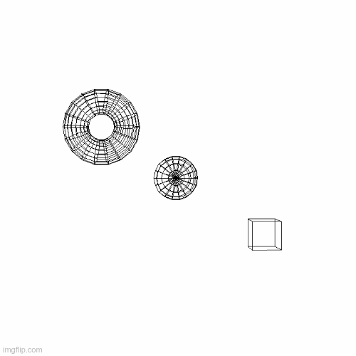

# OpenCV-3D-Renderer

This repository renders 3D shapes using OpenCV. A camera is simulated and its intrinsic and extrinsic matrices are defined. Similarly, 3D shapes such as cube, sphere and torus can also be defined in 3 dimensional space. The 3D coordinates of these shapes are projected onto a 2 dimensional plane using the camera matrices, these 2D points are then drawn to the screen.

